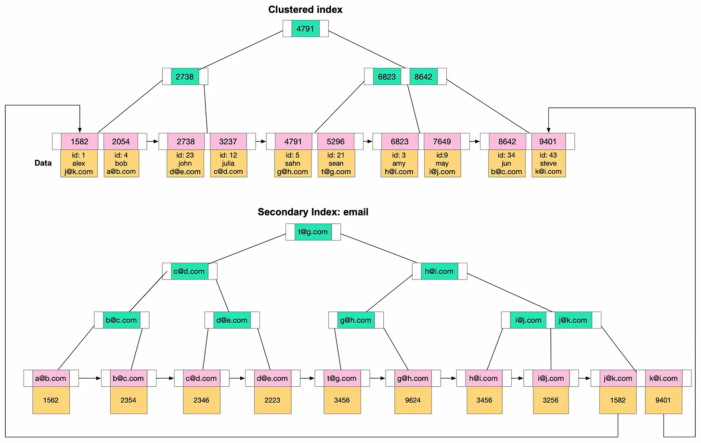
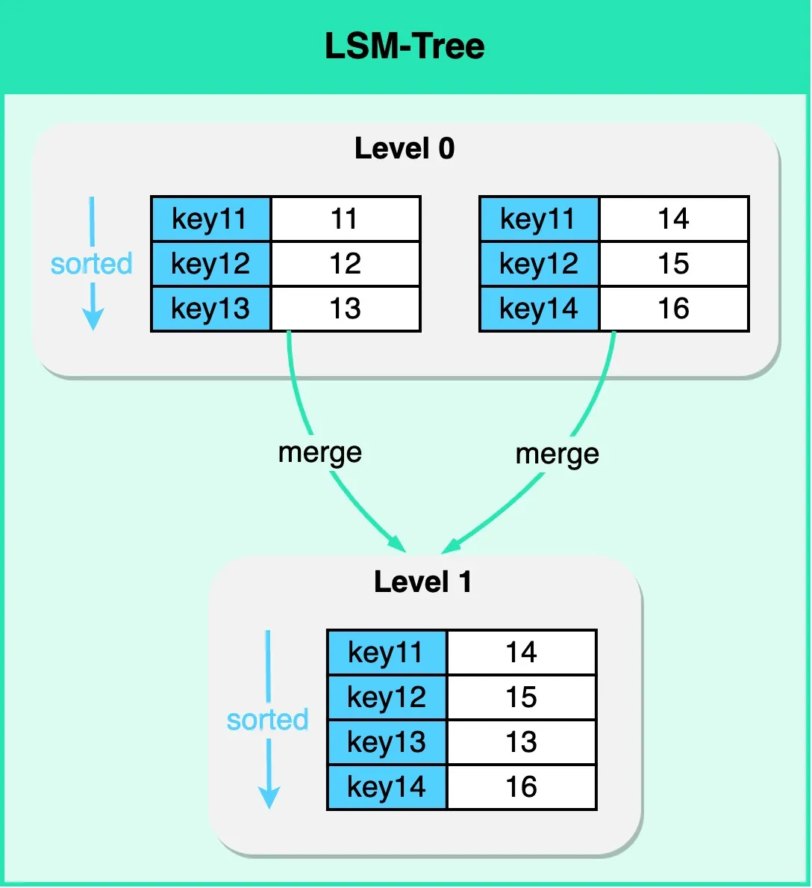
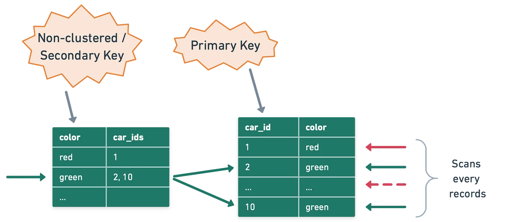
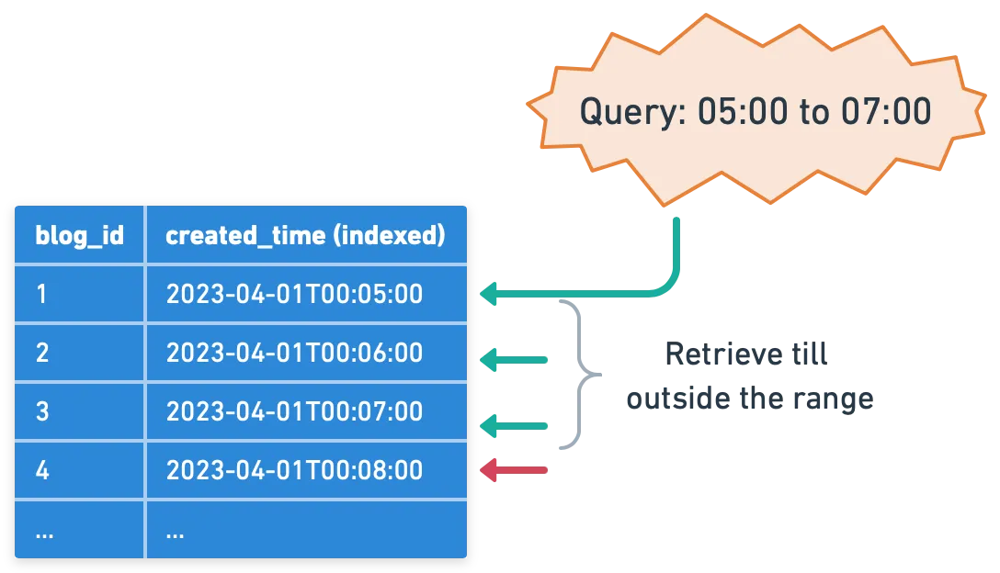
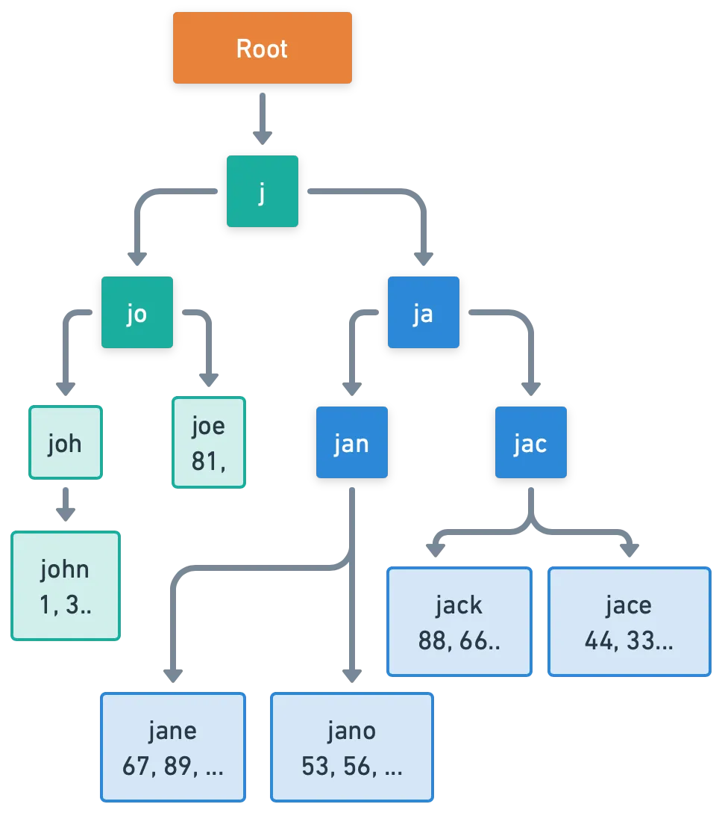

# Database

## [[MySQL]]

With B+Tree index:

- Primary indexes are often referred to as clustered indexes or another term that I prefer index-organized table. This means the primary index is the table.
- Secondary index the key is whatever column(s) you indexed and the value is a pointer to where the full row really live. The value of secondary index leaf pages are usually primary keys.

In MySQL updating a column that is not indexed will result in only updating the leaf page where the row is with the new value. No other secondary indexes need to be updated because all of them point to the primary key which didn’t change.

Data types: In MySQL choosing the primary key data type is critical, as that key will live in all secondary indexes. For example a UUID primary key will bloat all secondary indexes size causing more storage and read I/Os.

Undo log: When a transaction makes a change to a row, the change is written to the page in the shared buffer pool so the page where the row live always has the latest data. The transaction then logs information of how to undo the latest changes to row (enough info to construct the old state) in an undo log, this way concurrent transactions that still need the old state based on their isolation level must crack the undo log and construct the old row.

## [[PostgreSQL]]

In Postgres technically there is no primary index, all indexes are secondary and all point to system managed tuple ids in data pages loaded in the heap. The table data in the heap are unordered, unlike primary index leaf pages which are ordered. That is why Postgres tables are often referred to as “heap organized tables” instead of “index organized tables”.

It is important to note that updates and deletes in Postgres are actually inserts. Every update or delete creates a new tuple id and the old tuple id is kept for MVCC reasons.

In Postgres looking up any secondary index will only require one index lookup followed by a constant single I/O to the heap to fetch the page where the full row live. One B+Tree lookup is better than two lookups of course.

Postgres attempts to minimize random reads by using bitmap index scans, grouping the results into pages instead of tuples and fetching the pages from the heap in fewer I/Os possible. Later additional filtering is applied to present the candidate rows.

Data types: In Postgres the tuple id is fixed 4 bytes so the secondary indexes won’t have the UUID values but just the tids pointing the heap.

Undo log: Postgres does this very differently, each update, insert and delete gets a new copy of the row with a new tuple id with hints about what transaction id created the tuple and what transaction id deleted the tuple. So Postgres can safely write the changes to the data pages and concurrent transactions can read the old or new tuples based on their transaction id. Clever design.

## Indexing

### B+ Tree

The B+ Tree is a specific type of tree data structure, and understanding it requires some background on its predecessor, the [[B-Tree]].

The B-Tree, or Balanced Tree, is a self-balancing tree data structure that maintains sorted data and allows for efficient insertion, deletion, and search operations. All these operations can be performed in O(Log N) time.

Here’s what distinguishes the structure of a B-Tree:

- All leaves are at the same level - this is what makes the tree 'balanced'.
- All internal nodes (except for the root) have a number of children ranging from d (the minimum degree of the tree) to 2d. The root, however, has at least two children.
- A non-leaf node with ‘k' children contains k-1 keys. This means if a node has three children (k=3), it will hold two keys (k-1) that segment the data into three parts corresponding to each child node.

The B+ Tree is a variant of the B-Tree and is widely used in disk-based storage systems, especially for database indexes. The B+ Tree has certain unique characteristics that improve on the B-Tree.

- In a B+ Tree, the data pointers (the pointers to the actual records) are stored only at the leaf nodes. The internal nodes only contain keys and pointers to other nodes. This means that many more keys can be stored in internal nodes, reducing the overall height of the tree. This decreases the number of disk accesses required for many operations.
- All leaf nodes are linked together in a linked list. This makes range queries efficient. We can access the first node of the range and then simply follow the linked list to retrieve the rest.
- In a B+ Tree, every key appears twice, once in the internal nodes and once in the leaf nodes. The key in the internal nodes acts as a division point for deciding which subtree the desired value could be in.

|        Attribute        |                                           B-tree                                           |                                                    B+ tree                                                    |
| ----------------------- | ------------------------------------------------------------------------------------------ | ------------------------------------------------------------------------------------------------------------- |
| Structure               | Both leaf and internal nodes store keys and data                                           | Only leaf nodes store data (or pointers to data), while internal nodes only store keys                        |
| Data accessibility      | Data can be accessed directly from both leaf and internal nodes                            | Data can only be accessed by traversing to leaf nodes                                                         |
| Efficiency              | May be slightly less efficient for range queries as data is scattered throughout all nodes | More efficient for range queries as all data is located in leaf nodes, which are linked for easy traversal    |
| Insertion and Deleteion | Can be slightly more complex due to data being scattered across all nodes                  | Slightly more efficient, as data resides only at, leaf nodes, reduciing the need for frequent re-organization |
| Space ultilization      | Might be less efficient, as all nodes store data                                           | more space-efficient, as data is stored only at leaf nodes                                                    |
| Use cases               | Useful for database systems where data retrieval is usually targeted (i.e., specific keys) | More commonly used in database and file systems where range queries are more common                           |

## Clustered Index

A clustered index reorders the way records in the table are physically stored. It does not store rows randomly or even in the order they were inserted. Instead, it organizes them to align with the order of the index, hence the term “clustered”. The specific column or columns used to arrange this order is referred to as the clustered key.

The arrangement determines the physical order of data on disk.

However, because the physical data rows can be sorted in only one order, a table can have only one clustered index. Adding or altering the clustered index can be time-consuming, as it requires physically reordering the rows of data.

It's also important to select the clustered key carefully. Typically, it's beneficial to choose a unique, sequential key to avoid duplicate entries and minimize page splits when inserting new data. This is why, in many databases, the primary key constraint automatically creates a clustered index on that column if no other clustered index is explicitly defined.

However, **an exception** to this general guidance is [[PostgreSQL]]. **In PostgreSQL, data is stored in the order it was inserted, not based on the clustered index or any other index**. However, PostgreSQL provides the CLUSTER command, which can be used to reorder the physical data in the table to match a specific index. It's important to note that this physical ordering is not automatically maintained when data is inserted or updated - to maintain the order, the CLUSTER command needs to be rerun.

## Non-clustered Index

They maintain a distinct list of key values, with each key having a pointer indicating the location of the row that contains that value. The pointers tie the index entries back to the data pages.

Since non-clustered indexes are stored separately from the data rows, the physical order of the data isn't the same as the logical order established by the index. This separation means that accessing data using a non-clustered index involves at least two disk reads, one to access the index and another to access the data. This is in contrast to a clustered index, where the index and data are one and the same.

A major advantage of non-clustered indexes is that we can have multiple non-clustered indexes on a table, each being useful for different types of queries.

**It's important to consider the trade-off. While non-clustered indexes can speed up read operations, they can slow down write operations, as each index must be updated whenever data is modified in the table.**

## Primary index

The primary index of a database is typically the main means of accessing data. When creating a table, the primary key often doubles as a clustered index, which means that the data in the table is physically sorted on disk based on this key. This ensures quick data retrieval when searching by the primary key.

The efficiency of this setup largely depends on the nature of the primary key. If the key is sequential, writing to the table is generally efficient. But if the key isn't sequential, reshuffling of data might be needed to maintain the order. This can make the write process less efficient.

Note that while the primary key often serves as the clustered index, this is not a hard and fast rule. The clustered index could be based on any column or set of columns, not necessarily the primary key.

## NoSQL, LSM Tree, and Indexing

[[NoSQL]] databases are a broad class of database systems, designed for flexibility, scalability, and the ability to handle large volumes of structured and unstructured data. A popular data structure used in some types of NoSQL databases, notably key-value and wide-column stores, is the [[Log-Structured Merge-tree]] ([[LSM Tree]]). Unlike traditional B-Tree-based index structures, LSM Trees are optimized for write-intensive workloads, making them ideal for applications where the rate of data ingestion is high.

An LSM Tree is, in itself, a type of index. It maintains data in separate structures, each of which is a sorted tree-based index. The smaller structure resides in memory (known as a [[MemTable]]), while the larger one is stored on disk (called [[SSTables]]). Write operations are first made in the MemTable. When the MemTable reaches a certain size, its content is flushed to disk as an SSTable. The real magic of LSM Trees comes into play during read operations. While the read path is more complex due to data being spread across different structures, the LSM Tree employs techniques such as [[Bloom Filters]] and [[Partition Indexes]] to locate the required data rapidly.

## Secondary Index for LSM Tree-based Databases

The LSM tree is an efficient way to perform point lookups and range queries on primary keys. However, performing a query on a non-primary key requires a full table scan which is inefficient.

This is where a secondary index is useful. Creating a secondary index in an LSM Tree-based database involves creating a new LSM Tree, where the keys are the values of the field on which the index is created, and the values are the primary keys of the corresponding records. When a query is executed that involves the indexed field, the database uses the secondary index to rapidly locate the primary keys of the relevant records, and then retrieves the full records from the primary index.

However, one of the complexities of secondary indexes in LSM Tree-based databases is handling updates. Due to the write-optimized nature of LSM Trees, data in these databases is typically immutable, which means updates are handled as a combination of a write (for the new version of a record) and a delete (for the old version). To maintain consistency, both the primary data store and the secondary index need to be updated simultaneously. This can lead to performance trade-offs and increase the complexity of maintaining index consistency.

## Index use cases

### Point lookup

### Range lookup

### Prefix search

### Geo-location lookup

## Readmore

1. [Postgres vs MySQL](https://medium.com/@hnasr/postgres-vs-mysql-5fa3c588a94e)
2. [Why Ubers switch to MySQL from Postgres](https://www.youtube.com/watch?v=_E43l5EbNI4)
3. [PostgreSQL process architecture](https://medium.com/@hnasr/postgresql-process-architecture-f21e16459907)
4. Database indexing strategies [Part 1](https://blog.bytebytego.com/p/database-indexing-strategies) and [Part 2](https://blog.bytebytego.com/p/database-indexing-strategies-part)