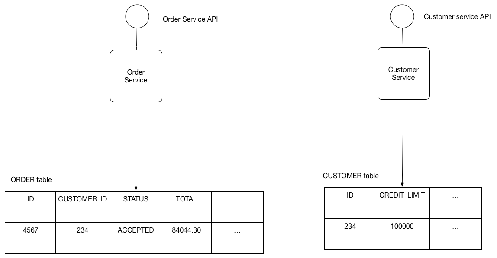

# Database per Service

## Context

Let’s imagine you are developing an online store application using the [[Microservice architecture pattern]]. Most services need to persist data in some kind of database. For example, the `Order Service` stores information about orders and the `Customer Service` stores information about customers.

## Problem

What’s the database architecture in a microservices application?

## Forces

- Services must be loosely coupled so that they can be developed, deployed and scaled independently
- Some business transactions must enforce invariants that span multiple services. For example, the `Place Order` use case must verify that a new Order will not exceed the customer’s credit limit. Other business transactions, must update data owned by multiple services.
- Some business transactions need to query data that is owned by multiple services. For example, the `View Available Credit` use must query the Customer to find the `creditLimit` and Orders to calculate the total amount of the open orders.
- Some queries must join data that is owned by multiple services. For example, finding customers in a particular region and their recent orders requires a join between customers and orders.
- Databases must sometimes be replicated and sharded in order to scale. See the [Scale Cube](https://microservices.io/articles/scalecube.html).
- Different services have different data storage requirements. For some services, a relational database is the best choice. Other services might need a NoSQL database such as MongoDB, which is good at storing complex, unstructured data, or Neo4J, which is designed to efficiently store and query graph data.

## Solution

Keep each microservice’s persistent data private to that service and accessible only via its API. A service’s transactions only involve its database.

The following diagram shows the structure of this pattern.

The service’s database is effectively part of the implementation of that service. It cannot be accessed directly by other services.

There are a few different ways to keep a service’s persistent data private. You do not need to provision a database server for each service. For example, if you are using a relational database then the options are:
- Private-tables-per-service – each service owns a set of tables that must only be accessed by that service
- Schema-per-service – each service has a database schema that’s private to that service
- Database-server-per-service – each service has it’s own database server.

Private-tables-per-service and schema-per-service have the lowest overhead. Using a schema per service is appealing since it makes ownership clearer. Some high throughput services might need their own database server.

It is a good idea to create barriers that enforce this modularity. You could, for example, assign a different database user id to each service and use a database access control mechanism such as grants. Without some kind of barrier to enforce encapsulation, developers will always be tempted to bypass a service’s API and access it’s data directly.

## Example

The [FTGO application](https://chrisrichardson.net/post/microservices/patterns/data/2019/07/15/ftgo-database-per-service.html) is an example of an application that uses this approach. Each service has database credentials that only grant it access its own (logical) database on a shared MySQL server. For more information, see this [blog post](https://chrisrichardson.net/post/microservices/patterns/data/2019/07/15/ftgo-database-per-service.html).

## Resulting context

Using a database per service has the following benefits:
- Helps ensure that the services are loosely coupled. Changes to one service’s database does not impact any other services.
- Each service can use the type of database that is best suited to its needs. For example, a service that does text searches could use ElasticSearch. A service that manipulates a social graph could use Neo4j.

Using a database per service has the following drawbacks:
- Implementing business transactions that span multiple services is not straightforward. Distributed transactions are best avoided because of the CAP theorem. Moreover, many modern (NoSQL) databases don’t support them.
- Implementing queries that join data that is now in multiple databases is challenging.
- Complexity of managing multiple SQL and NoSQL databases

There are various patterns/solutions for implementing transactions and queries that span services:
- Implementing transactions that span services - use the [[Saga]] pattern.
- Implementing queries that span services:
  - [[API Composition]] - the application performs the join rather than the database. For example, a service (or the API gateway) could retrieve a customer and their orders by first retrieving the customer from the customer service and then querying the order service to return the customer’s most recent orders.
  - [[Command Query Responsibility Segregation]] ([[CQRS]]) - maintain one or more materialized views that contain data from multiple services. The views are kept by services that subscribe to events that each services publishes when it updates its data. For example, the online store could implement a query that finds customers in a particular region and their recent orders by maintaining a view that joins customers and orders. The view is updated by a service that subscribes to customer and order events.

## Related patterns

- [[Microservice architecture pattern]] creates the need for this pattern
- [[Saga]] pattern is a useful way to implement eventually consistent transactions
- The [[API Composition]] and [[Command Query Responsibility Segregation]] ([[CQRS]]) pattern are useful ways to implement queries
- The [[Shared Database]] anti-pattern describes the problems that result from microservices sharing a database