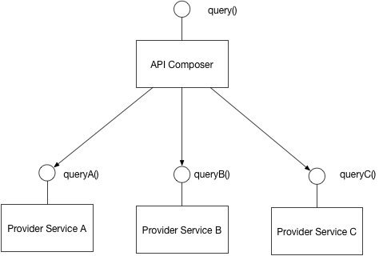

# API Composition

## Context

You have applied the [[Microservices architecture pattern]] and the [[Database per service]] pattern. As a result, it is no longer straightforward to implement queries that join data from multiple services.

## Problem

How to implement queries in a microservice architecture?

## Solution

Implement a query by defining an *API Composer*, which invoking the services that own the data and performs an in-memory join of the results.

## Example

An API Gateway often does API composition.

## Resulting context

This pattern has the following benefits:
- It a simple way to query data in a microservice architecture

This pattern has the following drawbacks:
- Some queries would result in inefficient, in-memory joins of large datasets.

## Related patterns

- The [[Database per Service]] pattern creates the need for this pattern
- The [[CQRS]] pattern is an alternative solution