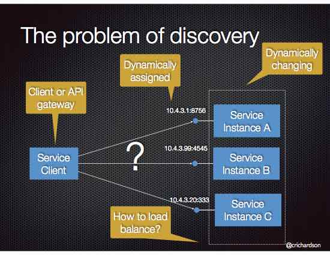

# Client-side discovery

## Context

Services typically need to call one another. In a monolithic application, services invoke one another through language-level method or procedure calls. In a traditional distributed system deployment, services run at fixed, well known locations (hosts and ports) and so can easily call one another using HTTP/REST or some RPC mechanism. However, a modern microservice-based application typically runs in a virtualized or containerized environments where the number of instances of a service and their locations changes dynamically.



Consequently, you must implement a mechanism for that enables the clients of service to make requests to a dynamically changing set of ephemeral service instances.

## Problem

How does the client of a service - the API gateway or another service - discover the location of a service instance?

## Forces

- Each instance of a service exposes a remote API such as HTTP/REST, or Thrift etc. at a particular location (host and port)
- The number of services instances and their locations changes dynamically.
- Virtual machines and containers are usually assigned dynamic IP addresses.
- The number of services instances might vary dynamically. For example, an EC2 Autoscaling Group adjusts the number of instances based on load.

## Solution

When making a request to a service, the client obtains the location of a service instance by querying a [[Service Registry]], which knows the locations of all service instances.

The following diagram shows the structure of this pattern.


This is typically handled by a [[Microservice chassis]] framework

## Examples

The [Microservices Example application](https://github.com/cer/microservices-examples) is an example of an application that uses client-side service discovery. It is written in Scala and uses [[Spring Boot]]  and [[Spring Cloud]] as the [[Microservice chassis]]. They provide various capabilities including client-side discovery.

`RegistrationServiceProxy` is a component of that application. In order to register a user, it invokes another service using the Spring Framework's `RestTemplate`:

```java
@Component
class RegistrationServiceProxy @Autowired()(restTemplate: RestTemplate) extends RegistrationService {

  @Value("${user_registration_url}")
  var userRegistrationUrl: String = _

  override def registerUser(emailAddress: String, password: String): Either[RegistrationError, String] = {

      val response = restTemplate.postForEntity(userRegistrationUrl,
        RegistrationBackendRequest(emailAddress, password),
        classOf[RegistrationBackendResponse])
       ...
}
```

It is injected with the RestTemplate and the `user_registration_url`, which specifies the REST endpoint.

When the application is deployed `user_registration_url` is set to this URL `http://REGISTRATION-SERVICE/user` - see the `docker-compose.yml` file. `REGISTRATION-SERVICE` is the logical service name that is resolved to a network location using client-side service discovery. The service discovery is implemented using [[Netflix OSS]] (http://netflix.github.io/) components. It provides [[Eureka]] ([https://github.com/Netflix/eureka/wiki/Eureka-at-a-glance]) , which is a [[Service Registry]], and [Ribbon](https://github.com/Netflix/ribbon), which is an HTTP client that queries Eureka in order to route HTTP requests to an available service instance.

Client-side service discovery is configured using various [[Spring Cloud]] annotations:

```java
@Configuration
@EnableEurekaClient
@Profile(Array("enableEureka"))
class EurekaClientConfiguration {

  @Bean
  @LoadBalanced
  def restTemplate(scalaObjectMapper : ScalaObjectMapper) : RestTemplate = {
    val restTemplate = new RestTemplate()
    restTemplate.getMessageConverters foreach {
      case mc: MappingJackson2HttpMessageConverter =>
        mc.setObjectMapper(scalaObjectMapper)
      case _ =>
    }
    restTemplate
  }
}
```

The `@EnableEurekaClient` annotation enables the [[Eureka]] client. The `@LoadBalanced` annotation configures the RestTemplate to use [[Ribbon]], which has been configured to use the [[[Eureka]]] client to do service discovery. As a result, the `RestTemplate` will handle requests to the `http://REGISTRATION-SERVICE/user` endpoint by querying [[Eureka]] to find the network locations of available service instances.

## Resulting context

Client-side discovery has the following benefits:
- Fewer moving parts and network hops compared to [[Server-side Discovery]]

Client-side discovery also has the following drawbacks:
- This pattern couples the client to the [[Service Registry]]
- You need to implement client-side service discovery logic for each programming language/framework used by your application, e.g Java/Scala, JavaScript/NodeJS. For example, [Netflix Prana](https://github.com/Netflix/Prana) provides an HTTP proxy-based approach to service discovery for non-JVM clients.

## Related patterns

- [[Service Registry]] - an essential part of service discovery
- [[Microservice chassis]] - Client-side service discovery is the responsibility the microservice chassis framework
- [[Server Side Discovery]] is an alternative solution to this problem.
