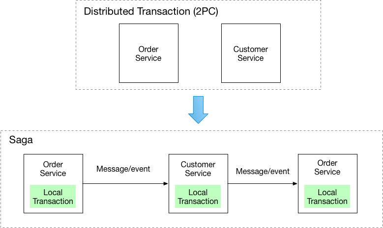
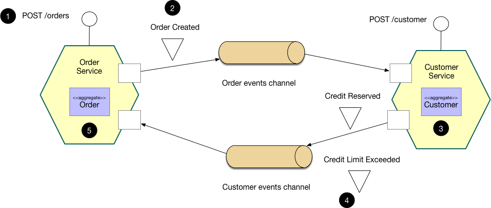

# Saga

## Context

You have applied the [[Database per Service]] pattern. Each service has its own database. Some business transactions, however, span multiple service so you need a mechanism to implement transactions that span services. For example, let's imagine that you are building an e-commerce store where customers have a credit limit. The application must ensure that a new order will not exceed the customer's credit limit. Since Orders and Customers are in different databases owned by different services the application cannot simply use a local [[ACID]] transaction.

## Problem

How to implement transactions that span services?

## Forces

[[2PC]] is not an option

## Solution

Implement each business transaction that spans multiple services is a saga. A saga is a sequence of local transactions. Each local transaction updates the database and publishes a message or event to trigger the next local transaction in the saga. If a local transaction fails because it violates a business rule then the saga executes a series of compensating transactions that undo the changes that were made by the preceding local transactions.

There are two ways of coordination sagas:
- [[Choreography]] - each local transaction publishes domain events that trigger local transactions in other services
- [[Orchestration]] - an orchestrator (object) tells the participants what local transactions to execute

## Example: Choreography-based saga

An e-commerce application that uses this approach would create an order using a choreography-based saga that consists of the following steps:

1. The `Order Service` receives the `POST /orders` request and creates an `Order` in a `PENDING` state
2. It then emits an `Order Created` event
3. The `Customer Service`'s event handler attempts to reserve credit
4. It then emits an event indicating the outcome
5. The `OrderService`'s event handler either approves or rejects the `Order`

## Example: Orchestration-based saga

An e-commerce application that uses this approach would create an order using an orchestration-based saga that consists of the following steps:
1. The `Order Service` receives the `POST /orders` request and creates the `Create Order` saga orchestrator
2. The saga orchestrator creates an `Order` in the `PENDING` state
3. It then sends a `Reserve Credit` command to the `Customer Service`
4. The `Customer Service` attempts to reserve credit
5. It then sends back a reply message indicating the outcome
6. The saga orchestrator either approves or rejects the `Order`

## Resulting context

This pattern has the following benefits:
- It enables an application to maintain data consistency across multiple services without using distributed transactions

This solution has the following drawbacks:
- The programming model is more complex. For example, a developer must design compensating transactions that explicitly undo changes made earlier in a saga.

There are also the following issues to address:
- In order to be reliable, a service must atomically update its database and publish a message/event. It cannot use the traditional mechanism of a distributed transaction that spans the database and the message broker. Instead, it must use one of the patterns listed below.
- A client that initiates the saga, which an asynchronous flow, using a synchronous request (e.g. HTTP `POST /orders`) needs to be able to determine its outcome. There are several options, each with different trade-offs:
  - The service sends back a response once the saga completes, e.g. once it receives an `OrderApproved` or `OrderRejected` event.
  - The service sends back a response (e.g. containing the `orderID`) after initiating the saga and the client periodically polls (e.g. `GET /orders/{orderID}`) to determine the outcome
  - The service sends back a response (e.g. containing the `orderID`) after initiating the saga, and then sends an event (e.g. websocket, web hook, etc) to the client once the saga completes.

## Related patterns

- The [[Database per Service]] pattern creates the need for this pattern
- The following patterns are ways to atomically update state and publish messages/events:
  - [[Event sourcing]]
  - [[Transactional Outbox]]
- A choreography-based saga can publish events using [[Aggregates]] and [[Domain Events]]

## Learn more

- Read these blog posts on the Saga pattern:
  - [overview of sagas](https://chrisrichardson.net/post/antipatterns/2019/07/09/developing-sagas-part-1.html)
  - [saga coordination mechanisms: choreography and orchestration](https://chrisrichardson.net/post/sagas/2019/08/04/developing-sagas-part-2.html)
  - [implementing choreography-based sagas](https://chrisrichardson.net/post/sagas/2019/08/15/developing-sagas-part-3.html)
  - [implementing orchestration-based sagas](https://chrisrichardson.net/post/sagas/2019/12/12/developing-sagas-part-4.html)
- My book [Microservices patterns](https://microservices.io/book) describes this pattern in a lot more detail. The book's [example application](https://github.com/microservice-patterns/ftgo-application) implements orchestration-based sagas using the [Eventuate Tram Sagas framework](https://github.com/eventuate-tram/eventuate-tram-sagas).
- My [presentations](https://microservices.io/presentations) on sagas and asynchronous microservices.

## Example code

The following examples implement the customers and orders example in different ways:
- [Choreography-based saga](https://github.com/eventuate-tram/eventuate-tram-examples-customers-and-orders) where the services publish domain events using the [Eventuate Tram framework](https://github.com/eventuate-tram/eventuate-tram-core)
- [Orchestration-based saga](https://github.com/eventuate-tram/eventuate-tram-sagas-examples-customers-and-orders) where the `Order Service` uses a saga orchestrator implemented using the [Eventuate Tram Sagas framework](https://github.com/eventuate-tram/eventuate-tram-sagas)
- [Choreography and event sourcing-based saga](https://github.com/eventuate-examples/eventuate-examples-java-customers-and-orders) where the services publish domain events using the [Eventuate event sourcing framework](http://eventuate.io/)