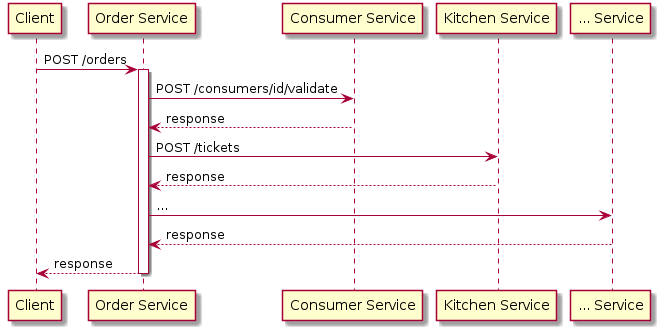
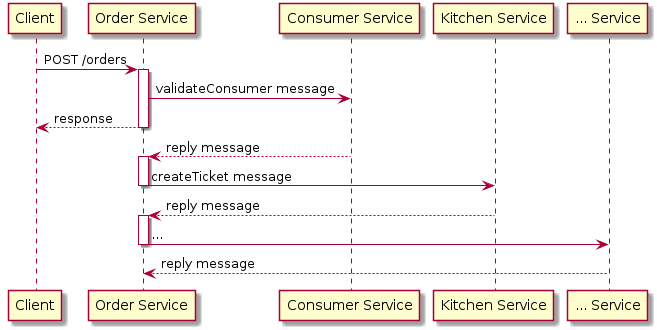
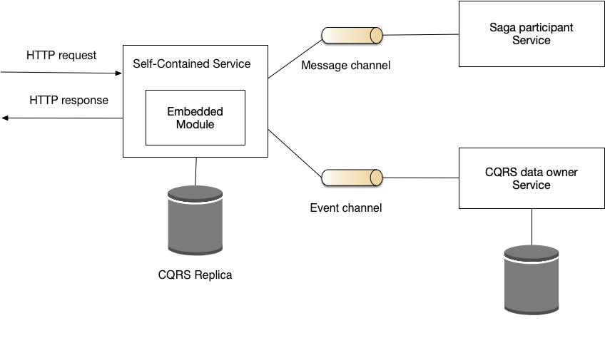

# Self-contained service

*I noted by the follow by [microservices.io](https://microservices.io/patterns/decomposition/self-contained-service.html), just in case the website cannot be visited anymore.*

## Context

Consider, the FTGO application, which is an online food delivery application. A client of application creates an order by making an HTTP `POST /orders` request and expects a response, say, within 600ms. Because the FTGO application uses the microservice architecture, the responsibilities that implement order creation are scattered across multiple services. The `POST` request is first routed to the `Order Service`, which must then collaborate with the following services:
- `Restaurant Service` - knows the restaurant's menu and prices
- `Consumer Service` - knows the state of the Consumer that places the order
- `Kitchen Service` - creates a Ticket, which tells the chef what to cook
- `Accounting Service` - authorizes the consumer's credit card

`The Order Service` could invoke each of these services using synchronous request/response. It might, for example, implement the inter-service communication using REST or gRPC.

However, a key drawback of using synchronous request/response is that it reduces availability. That's because if any of the `Order Sevice`'s collaborators are unavailable, it will not be able to create the order and must return an error to the client.

An alternative approach is to eliminate all synchronous communication between the `Order Service` and its collaborators by using the [[CQRS]] and [[Saga]] patterns. The `Order Service` can use the [[CQRS pattern]] to maintain a replica of the restaurant menu's and there by eliminate the need to synchronously fetch data from the `Restaurant Service`. It can validate the order asynchronously by using the [[Saga pattern]]. The `Order Service` creates an `Order` in a `PENDING` state and sends back a response to the `POST /order`. It then completes the creation of the order by communicating asynchronously with the other services.

A key benefit of this approach is that it improves availability. The `Order Service` always respond to a `POST /orders` request even when one of the other services is unavailable. One drawback, however, of using a saga to complete the creation of the order is that the response to the `POST` doesn't tell the client whether the order was approved. The client must find out by periodically invoking `GET /orders/{orderId}`.

## Problem

How should a service collaborate with other services when handling a synchronous request?

## Forces

- The microservice architecture often distributes the responsibility of handling a request amongst multiple services
- An operation is typically required to be highly available with a low response time
- The availability of an operation is the product of the availabilities of the services that are invoked while handling a request: 
- A service can retry a request to a failed collaborator but this increases response time.

## Solution

Design a service so that it can respond to a synchronous request without waiting for the response from any other service.

One way to make a service self-contained is to implement needed functionality as a service module rather than a separate service. We could, for example, merge the `Order Service` and `Restaurant Service`.

Another way to make a service self-contained is for it to collaborate with other services using the [[CQRS]] and the [[Saga]] patterns. A self-contained service uses the [[Saga pattern]] to asynchronously maintain data consistency. It uses the [[CQRS pattern]] to maintain a replica of data owned by other services.

## Example

The `Order Service` in the FTGO application described earlier is an example of a self-contained service. The `createOrder()` operation, for example, queries a CQRS replica of data owned by the `Restaurant Service` to validate and price the order, and then initiates a saga to finish the creation of the order.

## Resulting Context

This pattern has the following benefits:
- Improved availability and response time

This pattern has the following drawbacks:
- Increased cost and complexity of using CQRS
- Increased complexity of using sagas
- Less straightforward API when using sagas
- Larger service due to functionality being implemented in the service instead of as a separate service

## Related patterns

- [[Microservice architecture]] - creates the need for this pattern
- [[Saga]] - used by a service self-contained to asynchronously maintain data consistency
- [[CQRS]] - used by a service self-contained to maintain a replica of data owned by other services