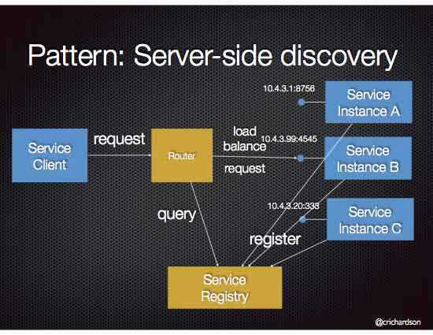

# Server-side discovery

## Context

Services typically need to call one another. In a monolithic application, services invoke one another through language-level method or procedure calls. In a traditional distributed system deployment, services run at fixed, well known locations (hosts and ports) and so can easily call one another using HTTP/REST or some RPC mechanism. However, a modern microservice-based application typically runs in a virtualized or containerized environments where the number of instances of a service and their locations changes dynamically.

Consequently, you must implement a mechanism for that enables the clients of service to make requests to a dynamically changing set of ephemeral service instances.

## Problem

How does the client of a service - the [[API gateway]] or another service - discover the location of a service instance?

## Forces

- Each instance of a service exposes a remote API such as HTTP/REST, or Thrift etc. at a particular location (host and port)
- The number of services instances and their locations changes dynamically.
- Virtual machines and containers are usually assigned dynamic IP addresses.
- The number of services instances might vary dynamically. For example, an EC2 Autoscaling Group adjusts the number of instances based on load.

## Solution

When making a request to a service, the client makes a request via a router (a.k.a load balancer) that runs at a well known location. The router queries a [[service registry]], which might be built into the router, and forwards the request to an available service instance.

The following diagram shows the structure of this pattern.

## Examples

An [[AWS Elastic Load Balancer]] (ELB) is an example of a server-side discovery router. A client makes HTTP(s) requests (or opens TCP connections) to the ELB, which load balances the traffic amongst a set of EC2 instances. An ELB can load balance either external traffic from the Internet or, when deployed in a VPC, load balance internal traffic. An ELB also functions as a [[Service Registry]]. EC2 instances are registered with the ELB either explicitly via an API call or automatically as part of an auto-scaling group.
[[]]
Some clustering solutions such as [[Kubernetes]] and Marathon run a proxy on each host that functions as a server-side discovery router. In order to access a service, a client connects to the local proxy using the port assigned to that service. The proxy then forwards the request to a service instance running somewhere in the cluster.

## Resulting context

Server-side service discovery has a number of benefits:
- Compared to [[client-side discovery]], the client code is simpler since it does not have to deal with discovery. Instead, a client simply makes a request to the router
- Some cloud environments provide this functionality, e.g. AWS Elastic Load Balancer

It also has the following drawbacks:
- Unless it's part of the cloud environment, the router must is another system component that must be installed and configured. It will also need to be replicated for availability and capacity.
- The router must support the necessary communication protocols (e.g [[HTTP]], [[gRPC]], [[Thrift]], etc) unless it is [[TCP]]-based [[router]]
- More network hops are required than when using [[Client Side Discovery]]

## Related patterns

- A router uses [[Service Registry]]
- A router might use a [[Circuit Breaker]] to invoke services
- [[Client Side Discovery]] is an alternative solution