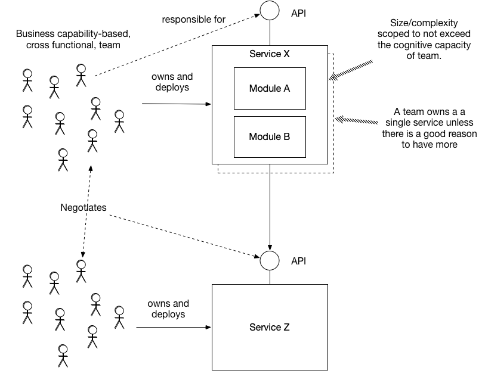

# Service per team

## Context

A high performance development organization consist of multiple teams. Each team is long-lived, small (typically 5-9 people), loosely coupled, autonomous, and cross-functional. Conway's law says an architecture mirrors the communication structure of the organization that builds it. Consequently, an organization consisting of loosely coupled teams needs a loosely coupled architecture.

One such loosely coupled architecture is the microservice architecture. It's an application style that structures an application as a loosely coupled set of services. [[Decompose by Subdomain]] and [[Decompose by business capability]] are patterns for identifying services and organizing them around business functionality. But what's the relationship between services and teams?

One approach is a shared ownership model where multiple teams to work on each service as necessary. For example, each team might be responsible for implementing features that span multiple services. On the one hand, this approach aligns teams with the user experience. But on the other hand, it increases the amount of coordination needed between the teams. Also, the lack of code ownership increases the risk of poor code quality.

A better approach, which increases team autonomy and loose coupling, is a code/service ownership model. The team, which is responsible for a business function/capability owns a code base, which they deploy as one of more services. As a result, the team can freely develop, test, deploy and scale its services. They primarily interact with other teams in order to negotiate APIs.

A team should ideally own just one service since that's sufficient to ensure team autonomy and loose coupling and each additional service adds complexity and overhead. A team should only deploy its code as multiple services if it solves a tangible problem, such as significantly reducing lead time or improving scalability or fault tolerance.

Since a team must be small, its cognitive capacity is limited. In order for the team to be productive, its code base should be scoped to not exceed the team's cognitive capacity. In other words, it must *fit* in the team's heads. As a result, there is an upper bound on the size and/or complexity of a service.

## Problem

What's the relationship between teams and services?

## Forces

- A team should be small, e.g. 5-9 people
- A team should be autonomous and loosely coupled
- The size and complexity of the team's code base must not exceed the team's cognitive capacity.
- Finer-grained service decomposition improves *-ilities* including maintainability, testability, deployability
- Finer-grained service decomposition adds complexity

## Solution

Each service is owned by a team, which has sole responsibility for making changes. Ideally each team has only one service:

Each team is responsible for one or more business functions (e.g. business capabilities). A team owns (has sole responsibility for changing) a code base consisting of one or more modules. Its code base is sized so as to not exceed the cognitive capacity of team. The team deploys its code as one or more services. A team should have exactly one service unless there is a proven need to have multiple services.

## Resulting context

This pattern has the following benefits:
- Enables each team to be autonomous and work with minimal coordination with other teams
- Enables the teams to be loosely coupled
- Achieves team autonomy and loose coupling with the minimum number of services
- Improves code quality due to long term code ownership

This pattern has the following drawbacks:
- Teams are not necessarily aligned with end user features
- Implementing features that span services is more complicated and requires teams to collaborate

## Related patterns

- [[Microservice architecture]] - creates the need for this pattern
- [[Decompose by Subdomain]] and [[Decompose by business capability]] are patterns for identifying services