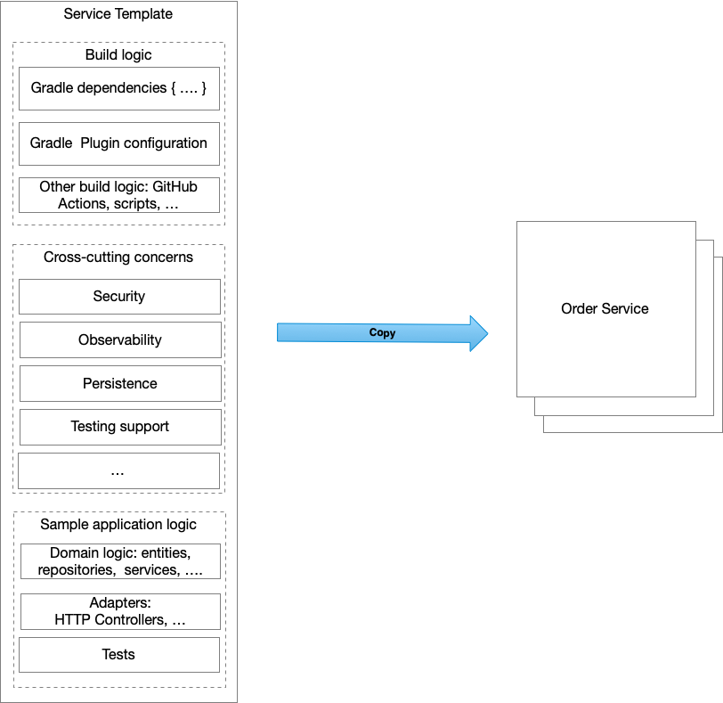

# Service template

## Context

When you start the development of an application you often spend a significant amount of time writing the build logic and putting in place the mechanisms to handle cross-cutting concerns. The build logic builds, and tests the application and also packages into a production-ready format, such as a Docker container image. For example, the majority of the build logic for a Java application is implemented using Gradle or Maven. It might also consist of configuration scripts for build automation tool, such as CircleCI or Github Actions. On the surface, the build logic appears to be quite simple. However, even defining a carefully curated set of dependencies can be remarkably challenging.

In addition to the build logic, you need to handle cross cutting concerns. Examples of cross-cutting concern include:
- [[Security]] - for example, REST APIs must be secured by requiring an [[Access Token]]
- [[Externalized configuration]] - includes credentials, and network locations of external services such as databases and message brokers
- [[Logging]] - configuring of a logging framework such as log4j or logback
- [[Health check]] - a url that a monitoring service can “ping” to determine the health of the application
- [[Metrics]] - measurements that provide insight into what the application is doing and how it is performing
- [[Distributed tracing]] - instrument services with code that assigns each external request an unique identifier that is passed between services.

As well as these generic cross-cutting concerns, there are also cross-cutting concerns that are specific to the technologies that an application uses. Applications that use infrastructure services such as databases or a message brokers require boilerplate configuration in order to do that. For example, applications that use a relational database must be configured with a connection pool. Web applications that process HTTP requests also need boilerplate configuration.

It is common to spend one or two days, sometimes even longer, writing the build logic and implementing cross-cutting concerns. If you going to spend months or years developing a monolithic application then the upfront investment is insignificant. The situation is very different, however, if you are developing an application that has the microservice architecture. There are tens or hundreds of services. You will frequently create new services, each of which will only take days or weeks to develop. You cannot afford to spend a few days setting up every service. What is even worse is that in a microservice architecture there are additional cross-cutting concerns that you have to deal with including service registration and discovery, and circuit breakers for reliably handling partial failure.

## Forces

- A service must implement
  - Build logic that builds, and tests the application and also packages into a production-ready format, such as a Docker container image.
  - Cross-cutting concerns such as externalized configuration, logging, health checks, metrics, service registration and discovery, circuit breakers. There are also cross-cutting concerns that are specific to the technologies that the microservices uses.
- Creating a new microservice should be fast and easy
- It should be fast and straightforward to update existing services when the requirements for build logic and cross-cutting concerns change.

## Solution

Create a source code template that a developer can copy in order to quickly start developing a new service. A template is a simple runnable service that implements the required build logic and cross cutting concerns along with sample application logic.

## Resulting context

This pattern has the following benefits:
- a developer can quickly and easy get started with developing a microservice.
- it ensures that cross-cutting concerns are implemented in a standardized consistent way

This pattern has the following drawbacks:
- when the build logic and cross-cutting concerns logic needs to change, you must update existing services individually.

This pattern has the following issues:
- you need a service template for each programming language/framework that you want to use. This can be an obstacle to adopting a new programming language or framework.

## Related patterns

[[Microservice Chassis]] - it’s either an alternative to the service template pattern; or, perhaps more likely, the service template uses a Microservice Chassis and simply contains the code and configuration that doesn’t belong in the chassis.

## See also

This excellent [Service Template blog post](https://blog.thepete.net/blog/2020/09/25/service-templates-service-chassis/) by [@ph1](https://twitter.com/ph1)