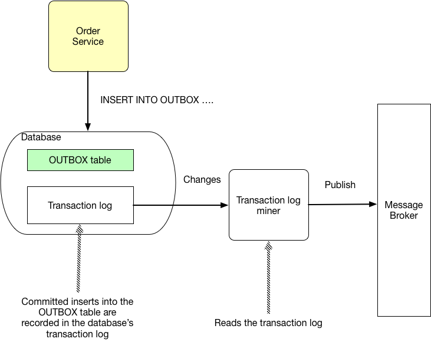

# Transaction log tailling

## Context

You have applied the [[Transactional Outbox]] pattern.

## Forces

## Solution

Tail the database transaction log and publish each message/event inserted into the *outbox* to the message broker.

The mechanism for trailing the transaction log depends on the database:
- MySQL binlog
- Postgres WAL
- AWS DynamoDB table streams

## Example

[Eventuate Tram framework](https://github.com/eventuate-tram/eventuate-tram-core) implements transaction log tailing.

## Resulting context

This pattern has the following benefits:
- No 2PC
- Guaranteed to be accurate

This pattern has the following drawbacks:
- Relatively obscure although becoming increasing common
- Requires database specific solutions
- Tricky to avoid duplicate publishing

## Related patterns

- The [[Transactional Outbox]] pattern creates the need for this pattern
- The [[Polling publisher]] pattern is an alternative solution

## Learn more

- My book [Microservices patterns](https://microservices.io/book) describes this pattern in a lot more detail.
- The [Eventuate Tram framework](https://github.com/eventuate-tram/eventuate-tram-core) implements this pattern