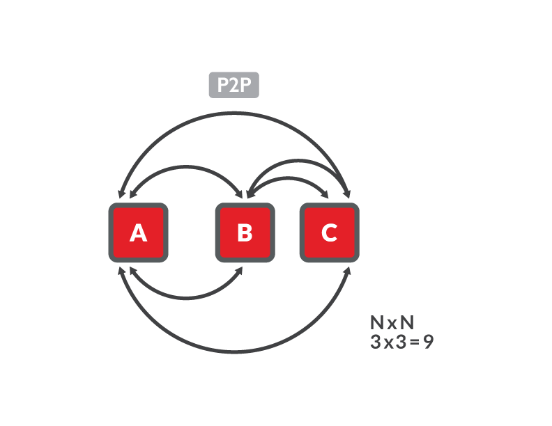
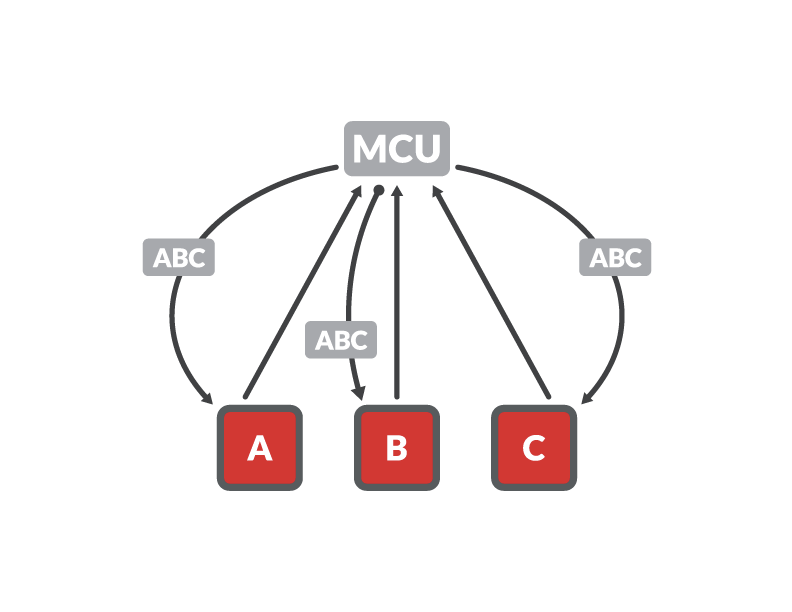
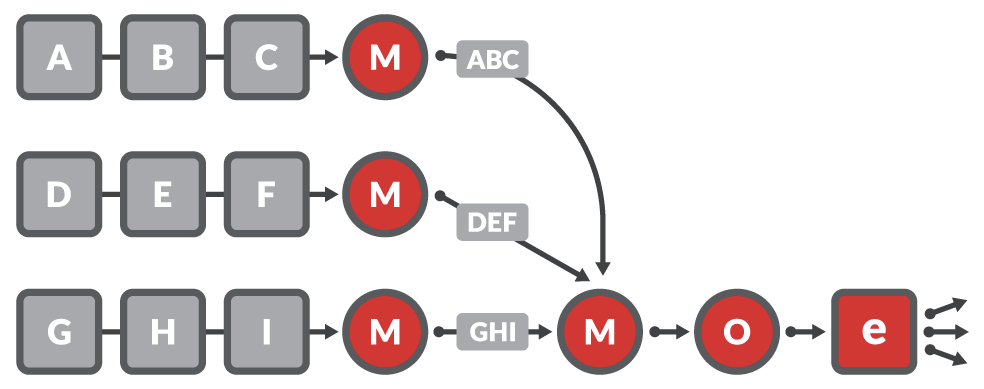

# WebRTC

## Peer to Peer (P2P)

[[P2P]] or [[Mesh]] is the easiest way to set up and most cost-effective architecture that you can use in a WebRTC application; it's also the least scalable. In this topology, two or more peers (clients) talk to each other directly or via a TURN server withch relays audio, video and data streaming to them.

This topology provides the best end-to-end encryption because it doesn't depend on a centralized server.

Advantages
- Easy to set up using a basic WebRTC implementation
- Better privacy
- Cost-effective because it doesn’t require a media server

Drawbacks
- Can connect only a small number of participants without noticeable decline in streaming quality
- CPU intensive because the processing of streams is offloaded to each peer

## Selective Forwarding Unit (SFU)

SFU is perhaps the most popular architecture in modern WebRTC applications. Put simply, an SFU is a pass-through routing system designed to offload some of the stream processing from the client to the server. Each participant sends their encrypted media streams once to a centralized server, which then forwards those streams—without further processing—to the other participants. Although an SFU is more upload efficient than a mesh topology—for example, on a call with n participants you have only one upstream per client rather than n–1 upstreams—clients still have to decode and render multiple (n-1) downstreams which, as the number of participants grows, will drain client resources, reduce video quality, and thus limit scalability.

Advantages
- Requires less upload bandwidth than a P2P mesh
- Streams are separate, so each can be rendered individually - allowing full control of the layout of streams on the client side

Drawbacks
- Limited scalability
- Higher operational costs as some CPU load is shifted to the server

## Multipoint Conferencing Unit (MCU)

MCU has been the backbone of large-group conferencing systems for many years. This is not surprising given its ability to deliver stable, low-bandwidth audio/video streaming by offloading much of the CPU-intensive stream processing from the client to a centralized server.

Advantages
- Bandwidth friendly
- Composite output simplifies integration with external services
- Your only option when you need to combine many streams (unless you use an XDN approach, which we’ll discuss next)

Drawbacks
- CPU intensive; the more streams the bigger your server
- Single point-of-failure risk because of centralized processing
- High operational costs due to computational load on server

## Experience Delivery Network (XDN)

XDN presents a new approach to extending WebRTC that combines elements of both SFU and MCU. Unlike SFU and MCU, however, XDN uses a cloud-based clustering architecture rather than a centralized server to tackle WebRTC’s scalability issues. Each cluster consists of a system of distributed server instances, or nodes, and includes origin, relay, or edge nodes. Within this topology, any given origin node ingests incoming streams and communicates with multiple edge nodes to support thousands of participants. For larger deployments, origin nodes can stream to relay nodes, which in turn stream to multiple edge nodes to scale the cluster even further to realize virtually unlimited scale. An XDN also supports so-called mixers that can be deployed between publishers and origin nodes, to combine many streams into a single stream that is then passed on to an origin node. A mixer is essentially an MCU that can be clustered in order to combine many more streams than a single-server MCU could handle.

The brains behind this operational cluster is a stream manager, which controls the nodes, performs load balancing, and replaces nodes should they fail for any reason. The stream manager is also responsible for connecting participants in a live-streaming event: it connects publishers to an origin node and subscribers to an edge node that is geographically closest to them.

## Read more

1. https://www.red5pro.com/blog/3-key-approaches-for-scaling-webrtc-sfu-mcu-and-xdn/