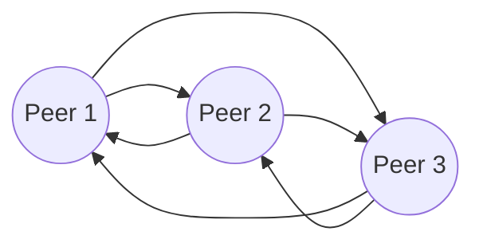

# WebRTC

## Peer to Peer (P2P)

[[P2P]] or [[Mesh]] is the easiest way to set up and most cost-effective architecture that you can use in a WebRTC application; it's also the least scalable. In this topology, two or more peers (clients) talk to each other directly or via a TURN server withch relays audio, video and data streaming to them.

This topology provides the best end-to-end encryption because it doesn't depend on a centralized server.

Advantages
- Easy to set up using a basic WebRTC implementation
- Better privacy
- Cost-effective because it doesn’t require a media server

Drawbacks
- Can connect only a small number of participants without noticeable decline in streaming quality
- CPU intensive because the processing of streams is offloaded to each peer

## Selective Forwarding Unit (SFU)

## Read more

1. https://www.red5pro.com/blog/3-key-approaches-for-scaling-webrtc-sfu-mcu-and-xdn/