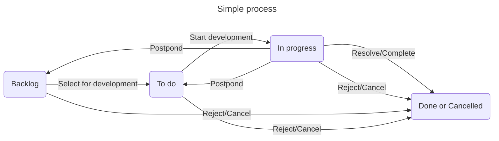
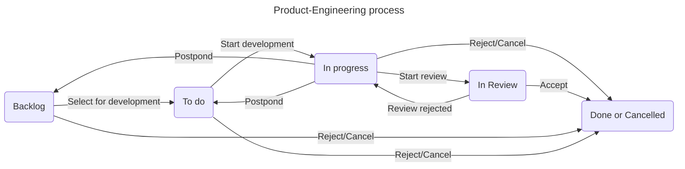
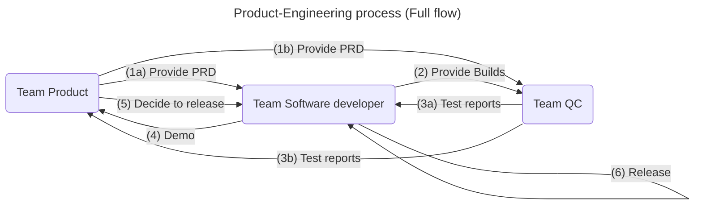

# Software Engineering processes

## Simple process

| Backlog                               | To do                                                      | In progress | Done                                              |
| ------------------------------------- | ---------------------------------------------------------- | ----------- | ------------------------------------------------- |
| All the requests, or the requirements | Tasks are decided to do in this iteration or this time | Doing tasks | Resolved tasks as Done, or Rejected, or Cancelled |

## Product-Engineering process

### Flow for each team

| Backlog                               | To do                                                      | In progress | Done                                              |
| ------------------------------------- | ---------------------------------------------------------- | ----------- | ------------------------------------------------- |
| All the requests, or the requirements | Tasks are decided to do in this iteration or this time | Doing tasks | Resolved tasks as Done, or Rejected, or Cancelled |

### Full flow

| Team       | Input                      | Work               | Ouput      |
| ---------- | -------------------------- | ------------------ | ---------- |
| Product    | Stakeholder's requirements | Analyze & Document | PRD        |
| Developers | PRD                        | Implement          | Builds     |
| QC         | PRD                        | Write test cases   | Test cases |
| QC         | Builds                     | Test               | Reports    |
