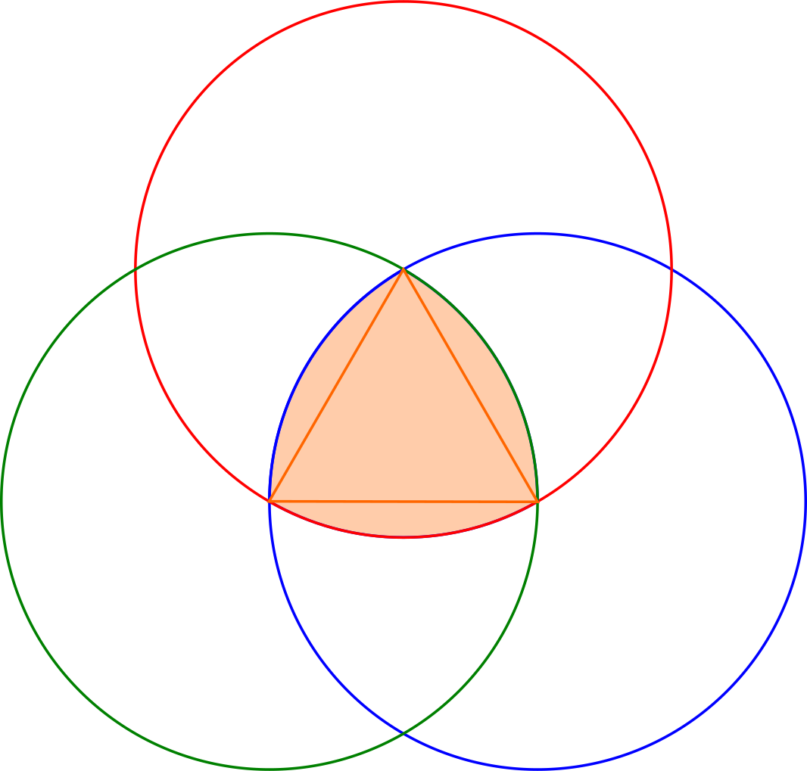
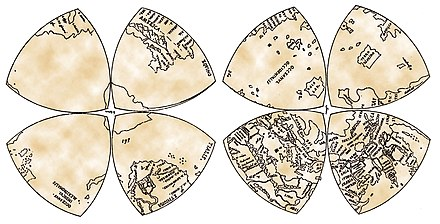
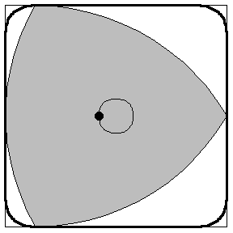
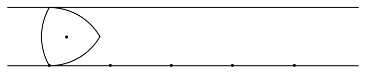

# Tam giác Reuleaux

Tam giác [[Reuleaux]] là hình đầu tiền trong đa giác Reuleaux, được tạo nên từ phần giao nhau của 3 đường tròn, với tâm là đỉnh của tam giác đều và đường kính là cạnh tam giác đều đó.

Vì các đường kính của tam giác Reuleaux bằng nhau, nên tam giác Reuleaux còn là đáp án cho câu hỏi *"Nắp cống hình gì để không tuột qua miệng cống"*.

Được lấy theo tên của kỹ sư người Đức Franz Reuleaux. Trước đó thì tam giác Reuleaux cũng đã được ứng dụng nhiều:

- Các cửa sổ của các nhà thờ Gothic.
- [[Leonardo da Vinci]] đã sử dụng trong phép chiếu bản đồ

- Trong nghiên cứu *Hình có độ rộng không đổi* của [[Leonhard Euler]].

Tam giác Reuleaux còn được ứng dụng trong tạo hình phím gảy guitar, trụ nước cứu hỏa, bút chì và mũi khoan tạo lỗ vuông, cũng như trong thiết kế đồ họa tạo hình bảng hiệu và logo. Nó có thể thực hiện một vòng quay hoàn chỉnh trong một hình vuông đồng thời luôn tiếp xúc cả bốn cạnh hình vuông. Trong các hình có tính chất này, tam giác Reuleux có diện tích nhỏ nhất. Tuy nhiên, dù có thể bao phủ hầu hết diện tích hình vuông khi quay, tam giác không quét hết được một phần nhỏ ở gần các góc hình vuông. Do tính chất có thể quay trong một hình vuông, tam giác Reuleaux đôi khi còn được gọi là rôto Reuleaux (Reuleaux rotor)

## Đọc thêm

- https://vi.wikipedia.org/wiki/Tam_gi%C3%A1c_Reuleaux