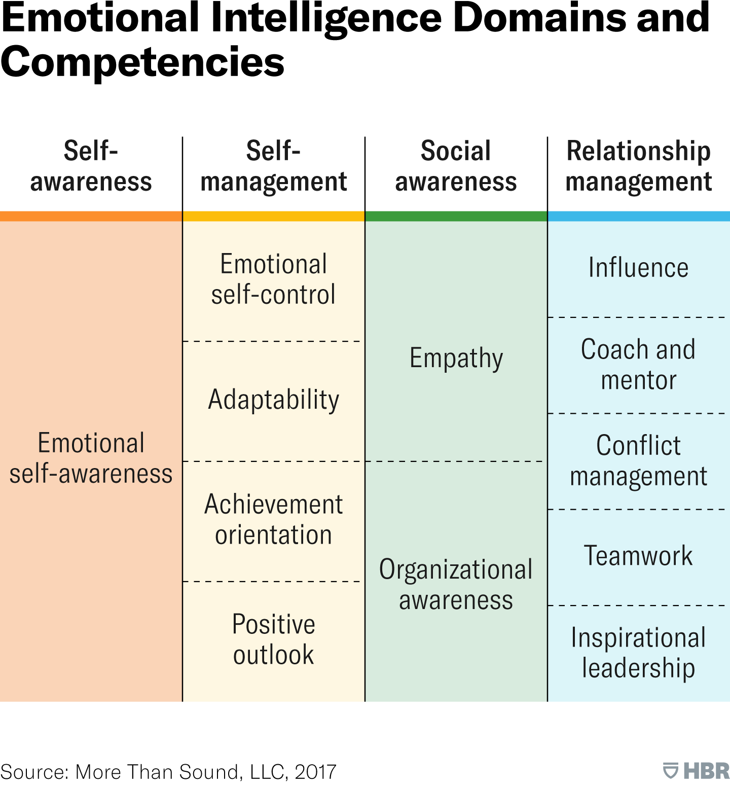
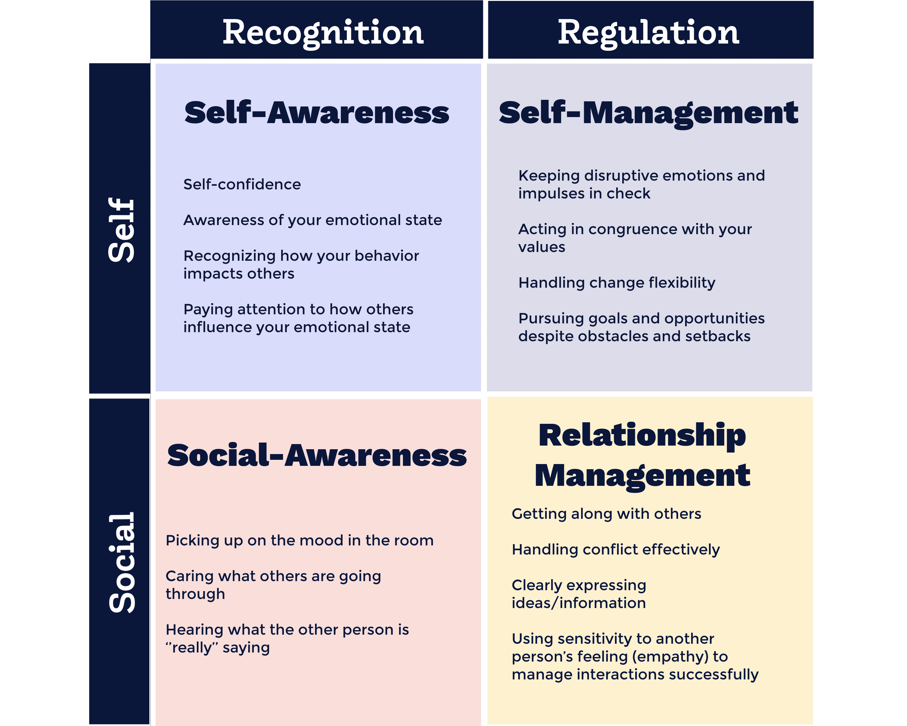

# Emotional intelligence

Emotional Integlligent includes 4 domains:

- Self-awareness
- Self-management
- Social awareness
- Relationship management

## Emotional intelligence domains and competencies

## Quadrants

